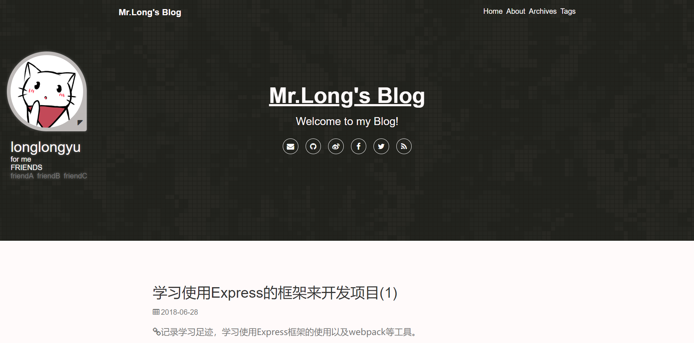

# hexo-theme-Cxo
A cool ，simple & beautiful theme for Hexo. 🍄



<p align="center">

<a href="https://longlongyu.github.io/"></a>
<a href="https://hexo.io"></a>
<a href="https://nodejs.org/"></a>
</p>

## 在线预览(Online demo)
观看主题：[Mr.Long's Blog](https://longlongyu.github.io/ "Mr.Long's Blog")

## 文档(Documentation)
- [English document](./README_CN.md)

## 浏览器支持(Browser Support)
IE >= 10

## 说明(Instruction)
- 目前本主题刚刚创建，可能有很多不足之处，如果有任何优化和功能方面的建议和想法，都欢迎提出和指证。
- 如果有使用上的问题，欢迎 [发起 issue](https:/github.com/Longlongyu/hexo-theme-Cxo/issues "发起 issue")
- 你的支持就是我的动力，我会持续的更新和维护，欢迎 star 。

## 安装(Install)
1. 在 **hexo** 的根目录执行

``` shell
git clone -b master https://github.com/Longlongyu/hexo-theme-Cxo themes/Cxo
```

2. 修改 **hexo** 的根目录下的 `_config.yml` 的 `theme` 字段为 `Cxo`

``` yaml
theme: Cxo
```

3. 如果你没有安装 `jade renderer` `sass renderer`,你还要执行

``` shell
npm install hexo-renderer-jade hexo-renderer-sass --save
```
## 更新(Version)

- 1.0.0 - 『拥有基本博客功能的Cxo』
- 1.0.1 - 『支持直接配置少量的评论插件』
- 1.0.2 - 『侧栏的开关状态现在会保存了』
- 1.0.3 - 『添加了置顶文章的显示』
- 1.0.4 - 『现在可以显示文章的最近修改时间，并根据其排序』
- 1.0.5 - 『添加自定义时间戳、定义摘要图片，添加了百度统计支持，并对文章目录进行了优化』
- 1.0.6 - 『移动端下 tab 栏显示问题』

## 主题更新(Theme Update)
在 **Cxo** 目录下执行 `git stash` 将本地的修改暂存，再执行 `git pull` 来获取最新的版本，
最后执行 `git stash pop` 将本地的修改还原。

## 其他配置(Other configuration)

- [启用 about 页](https://github.com/Longlongyu/hexo-theme-Cxo/wiki/%E5%BC%80%E5%90%AFabout%E9%A1%B5)
- [启用 tags 页](https://github.com/Longlongyu/hexo-theme-Cxo/wiki/%E5%BC%80%E5%90%AFtags%E9%A1%B5)
- [启用字数统计及阅读时间](https://github.com/Longlongyu/hexo-theme-Cxo/wiki/%E5%BC%80%E5%90%AF%E5%AD%97%E6%95%B0%E7%BB%9F%E8%AE%A1%E5%8F%8A%E9%98%85%E8%AF%BB%E6%97%B6%E9%97%B4)
- [启用文章置顶](https://github.com/Longlongyu/hexo-theme-Cxo/wiki/%E5%BC%80%E5%90%AF%E6%96%87%E7%AB%A0%E7%BD%AE%E9%A1%B6)
- [启用文章最修改时间](https://github.com/Longlongyu/hexo-theme-Cxo/wiki/%E5%BC%80%E5%90%AF%E6%96%87%E7%AB%A0%E6%9C%80%E8%BF%91%E4%BF%AE%E6%94%B9%E6%97%B6%E9%97%B4)
- [修改时间戳格式](https://github.com/Longlongyu/hexo-theme-Cxo/wiki/%E4%BF%AE%E6%94%B9%E6%97%B6%E9%97%B4%E6%88%B3%E6%A0%BC%E5%BC%8F)
- [文章添加摘要图片](https://github.com/Longlongyu/hexo-theme-Cxo/wiki/%E6%96%87%E7%AB%A0%E6%B7%BB%E5%8A%A0%E6%91%98%E8%A6%81%E5%9B%BE%E7%89%87)
- [一些hexo的markdown语法](https://github.com/Longlongyu/hexo-theme-Cxo/wiki/%E4%B8%80%E4%BA%9Bhexo%E7%9A%84markdown%E8%AF%AD%E6%B3%95)

## 主题配置(Theme configuration)

```yaml
# —————————— 资料 —————————— #
# 填写头像的路径
avatar:
# 博主名字
author:
# 博客的签名
signature:
# 友链
friends:
  friendA:
  friendB:
  friendC:
# 社交账号
social:
  email:
  github:
  weibo:
  facebook:
  twitter:
  rss:

# —————————— 站点 —————————— #
# 网站的title，每篇文章后面也会加上此字段利于SEO
SEO_title:
# 显示在网站头图上的主标题
main_title:
# 副标题
subtitle:
# 显示在网站的上banner图，如果不设置，默认都为site_header_image，site_header_image为必选项
site_header_image:
post_header_image:
about_header_image: 

# —————————— Indivdual —————————— #
# 标签缩略图
favicon: /img/assets/favicon.ico

# —————————— Option —————————— #
# 首页的文章摘要字数(默认为300)
truncate_length: 
# banner 高度 (默认是屏幕高度的70%, 可以修改成其他数字)
intro_height: 70
# 文章右侧的大纲
toc: true
# 字数统计 & 阅读时间，
reading_info: false
# 开启统计
count:
  # true or flase
  busuanzi: true
  # 填入百度统计的code
  baidu: 
# 时间相关配置
# 你现在可以配置时间戳格式
date_format: YYYY-MM-DD
# 显示文章创建时间
display_created: true
# 显示最近修改时间
display_updated: false
# 版权声明
copyright:
  enable: true
  # https://creativecommons.org/
  license: All articles in this blog are licensed under <a rel="license" href="https://creativecommons.org/licenses/by-nc-nd/3.0">CC BY-NC-SA 3.0</a> unless stating additionally.
# 评论插件
comment:
  # Livere  site: https://livere.com/
  livere_uid:
  # Disqus  site: https://disqus.com/
  disqus_shortname: 
  # Changyan  site: http://changyan.kuaizhan.com/
  changyan_appid: 
  changyan_conf:
  # Gitment  site: https://github.com/imsun/gitment/
  gitment_owner:
  gitment_repo:
  gitment_client_id:
  gitment_client_secret:
```

## License
[MIT](https://opensource.org/licenses/MIT/ "MIT")
